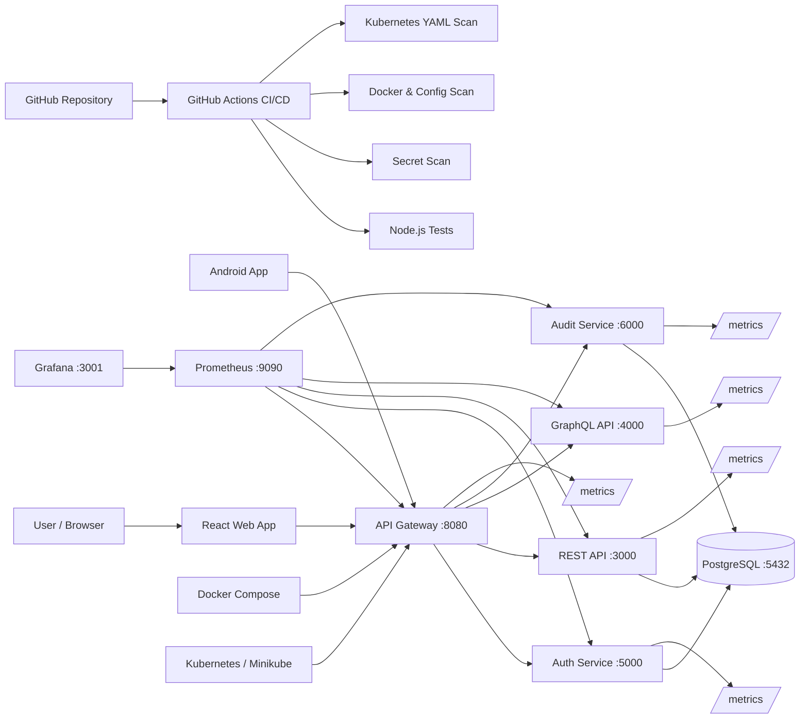

# DocApiNexus

**DocApiNexus** is a local full-stack API engineering, microservices, and DevSecOps lab project. It demonstrates how REST APIs, GraphQL APIs, authentication services, audit logging, PostgreSQL, Docker, Kubernetes, CI/CD security scanning, API Gateway routing, and observability tools can work together in one practical architecture.

---

## Abstract

DocApiNexus is designed as a hands-on cybersecurity and software engineering project to build, secure, deploy, monitor, and document modern API-based systems. The project starts with basic API development and gradually evolves into a DevSecOps-ready microservices environment.

The system includes REST API, GraphQL API, JWT-based authentication, bcrypt password hashing, PostgreSQL database integration, React web frontend, Android app integration, Docker containerization, Docker Compose orchestration, Kubernetes deployment with Minikube, GitHub Actions CI/CD security scanning, API Gateway routing, audit logging, database migrations, and observability using Prometheus and Grafana.

The main purpose of this project is to understand how real-world API platforms are built and secured from the ground up.

---

## Introduction

Modern applications rarely depend on a single backend service. Most real-world systems use multiple APIs, identity services, databases, frontend applications, mobile apps, gateways, security controls, pipelines, and monitoring platforms.

DocApiNexus was created to simulate that environment locally. The project focuses on building a complete API ecosystem using open-source tools and local infrastructure. It avoids cloud dependency in the initial phase so that the core concepts can be learned clearly before moving to cloud platforms like AWS, Azure, or GCP.

The project is useful for learning:

* API development
* REST and GraphQL security
* JWT authentication
* Password hashing
* Microservices communication
* API Gateway design
* Docker and Kubernetes deployment
* CI/CD pipeline security
* Database migrations
* Observability and monitoring
* DevSecOps engineering practices

---

## Project Goal

The goal of DocApiNexus is to build a complete local API platform that demonstrates how modern services are developed, secured, deployed, scanned, and monitored.

The project acts as a practical learning lab for:

* API security
* Microservices architecture
* DevSecOps pipeline security
* Kubernetes deployment
* Observability engineering

---

## Project Objectives

The main objectives of this project are:

1. Build REST API services using Node.js and Express.
2. Build a GraphQL API service.
3. Implement JWT-based authentication.
4. Store passwords securely using bcrypt hashing.
5. Store users and audit logs in PostgreSQL.
6. Build a React web application as the frontend client.
7. Build an Android app client using Android Studio.
8. Containerize all services using Docker.
9. Orchestrate services locally using Docker Compose.
10. Deploy services into Kubernetes using Minikube.
11. Add health checks, readiness probes, and liveness probes.
12. Harden Kubernetes workloads using security contexts.
13. Scan code, containers, secrets, and Kubernetes YAML in CI/CD.
14. Add API Gateway as a single entry point.
15. Add audit-service as a microservice.
16. Add database migrations for controlled schema changes.
17. Add structured JSON logging and request IDs.
18. Add Prometheus metrics endpoints.
19. Add Prometheus and Grafana observability configuration.
20. Prepare the project as a professional GitHub portfolio project.

---

## High-Level Architecture



---

## Architecture Explanation

DocApiNexus follows a layered architecture.

### Client Layer

The client layer contains:

* React Web App
* Android App

Both clients communicate with the backend through the API Gateway.

### API Gateway Layer

The API Gateway is the single entry point for backend communication.

It routes traffic to:

* `/auth` → Auth Service
* `/api` → REST API
* `/graphql` → GraphQL API
* `/audit` → Audit Service

It also provides:

* Central routing
* Rate limiting
* Security headers
* Request logging
* Request ID propagation
* Metrics endpoint

### Service Layer

The service layer contains independent backend services.

| Service       | Purpose                                                            |
| ------------- | ------------------------------------------------------------------ |
| Auth Service  | Handles user registration, login, JWT creation, and authentication |
| REST API      | Provides protected REST endpoints                                  |
| GraphQL API   | Provides protected GraphQL queries                                 |
| Audit Service | Stores and retrieves audit/security event logs                     |
| API Gateway   | Routes client requests to internal services                        |

### Database Layer

PostgreSQL is used as the database.

It stores:

* User records
* Password hashes
* User roles
* Audit logs
* Migration history

### DevOps Layer

Docker, Docker Compose, Kubernetes, and GitHub Actions are used for:

* Containerization
* Local orchestration
* Kubernetes deployment
* CI/CD security checks
* Image scanning
* Kubernetes YAML scanning

### Observability Layer

Prometheus and Grafana are used for monitoring.

Prometheus collects metrics from each service’s `/metrics` endpoint.

Grafana displays dashboards using Prometheus as the datasource.

---

## Tools Used and Purpose

### Development Tools

| Tool               | Purpose                                      |
| ------------------ | -------------------------------------------- |
| Visual Studio Code | Code editing and project development         |
| Node.js            | Backend runtime environment                  |
| npm                | Package management                           |
| Express.js         | REST API and microservice framework          |
| GraphQL            | Query-based API layer                        |
| React              | Web frontend                                 |
| Vite               | React development server                     |
| Android Studio     | Android app development and emulator testing |

### Security Tools and Libraries

| Tool / Library     | Purpose                                        |
| ------------------ | ---------------------------------------------- |
| JWT                | Token-based authentication                     |
| bcryptjs           | Secure password hashing                        |
| Helmet             | HTTP security headers                          |
| CORS               | Cross-origin request handling                  |
| express-rate-limit | API rate limiting                              |
| Gitleaks           | Secret scanning in CI/CD                       |
| Trivy              | Docker image and config vulnerability scanning |
| Checkov            | Kubernetes YAML and IaC security scanning      |

### Database Tools

| Tool                    | Purpose                               |
| ----------------------- | ------------------------------------- |
| PostgreSQL              | Relational database                   |
| pg                      | Node.js PostgreSQL client             |
| SQL migrations          | Controlled database schema management |
| schema_migrations table | Tracks executed migrations            |

### Container and Orchestration Tools

| Tool                   | Purpose                                    |
| ---------------------- | ------------------------------------------ |
| Docker                 | Container image creation                   |
| Dockerfile             | Defines how each service image is built    |
| Docker Compose         | Runs all local containers together         |
| Minikube               | Local Kubernetes cluster                   |
| kubectl                | Kubernetes CLI                             |
| Kubernetes Deployments | Manage running application pods            |
| Kubernetes Services    | Provide stable internal service networking |
| Kubernetes Secrets     | Store sensitive configuration              |
| Kubernetes ConfigMaps  | Store non-sensitive configuration          |
| Kubernetes Jobs        | Run database migrations                    |

### CI/CD Tools

| Tool                 | Purpose                                |
| -------------------- | -------------------------------------- |
| GitHub               | Source code repository                 |
| GitHub Actions       | CI/CD pipeline automation              |
| actions/checkout     | Pulls repo code into GitHub runner     |
| actions/setup-node   | Prepares Node.js environment           |
| actions/setup-python | Prepares Python for Checkov            |
| npm audit            | Node.js dependency vulnerability check |
| Trivy Action         | Docker and config scanning             |
| Checkov              | Kubernetes YAML security scanning      |

### Observability Tools

| Tool         | Purpose                                          |
| ------------ | ------------------------------------------------ |
| prom-client  | Exposes Prometheus metrics from Node.js services |
| Prometheus   | Collects service metrics                         |
| Grafana      | Visualizes metrics in dashboards                 |
| JSON logs    | Structured logging                               |
| x-request-id | Tracks request flow across services              |

---

## Service Ports

| Component     | Port | URL                             |
| ------------- | ---: | ------------------------------- |
| Web App       | 5173 | `http://localhost:5173`         |
| API Gateway   | 8080 | `http://localhost:8080`         |
| Auth Service  | 5000 | `http://localhost:5000`         |
| REST API      | 3000 | `http://localhost:3000`         |
| GraphQL API   | 4000 | `http://localhost:4000/graphql` |
| Audit Service | 6000 | `http://localhost:6000`         |
| PostgreSQL    | 5432 | `localhost:5432`                |
| Prometheus    | 9090 | `http://localhost:9090`         |
| Grafana       | 3001 | `http://localhost:3001`         |

---

## Current Project Structure

```text
DocApiNexus
│
├── .github
│   └── workflows
│       └── ci-cd-security.yml
│
├── android-app
│
├── backend
│   ├── api-gateway
│   │   ├── server.js
│   │   ├── Dockerfile
│   │   └── package.json
│   │
│   ├── graphql-api
│   │   ├── server.js
│   │   ├── Dockerfile
│   │   └── package.json
│   │
│   ├── rest-api
│   │   ├── server.js
│   │   ├── Dockerfile
│   │   └── package.json
│   │
│   └── microservices
│       ├── auth-service
│       │   ├── server.js
│       │   ├── Dockerfile
│       │   └── package.json
│       │
│       └── audit-service
│           ├── server.js
│           ├── Dockerfile
│           └── package.json
│
├── database
│   ├── Dockerfile
│   ├── migrate.js
│   └── migrations
│       ├── 001_create_users_table.sql
│       └── 002_create_audit_logs_table.sql
│
├── k8s
│   └── base
│       ├── namespace.yaml
│       ├── secrets.yaml
│       ├── postgres.yaml
│       ├── postgres-init-configmap.yaml
│       ├── auth-service.yaml
│       ├── rest-api.yaml
│       ├── graphql-api.yaml
│       ├── api-gateway.yaml
│       ├── audit-service.yaml
│       ├── web-app.yaml
│       └── db-migration-job.yaml
│
├── observability
│   ├── prometheus
│   │   └── prometheus.yml
│   │
│   └── grafana
│       ├── provisioning
│       │   ├── datasources
│       │   │   └── datasource.yml
│       │   └── dashboards
│       │       └── dashboard.yml
│       │
│       └── dashboards
│           └── docapinexus-overview.json
│
├── web-app
│   ├── src
│   ├── Dockerfile
│   └── package.json
│
├── docker-compose.yml
├── package.json
└── README.md
```

---

## Main Features

### API Gateway

The API Gateway acts as the central entry point.

Features:

* Routes requests to backend services
* Applies security headers
* Applies CORS
* Applies rate limiting
* Generates request IDs
* Forwards request IDs to backend services
* Exposes `/health`
* Exposes `/metrics`

### Authentication

Auth Service supports:

* User registration
* User login
* Password hashing using bcrypt
* JWT token generation
* Protected profile endpoint

### REST API

REST API provides protected REST endpoints.

Example:

```text
GET /api/users
```

This endpoint requires a valid JWT token.

### GraphQL API

GraphQL API provides protected query access.

Example:

```graphql
{
  profile
}
```

### Audit Service

Audit Service stores security and application activity logs.

Example actions:

* Login test
* API access
* Gateway audit event
* Manual audit event

### Database Migrations

Database migrations are stored in:

```text
database/migrations
```

Migrations are executed using:

```cmd
npm run db:migrate
```

or through Docker/Kubernetes migration jobs.

### Observability

Each backend service exposes:

```text
/health
/metrics
```

Prometheus scrapes `/metrics`.

Grafana visualizes the collected metrics.

---

## Local Setup

### Prerequisites

Install:

* Node.js
* npm
* Git
* Docker Desktop
* Docker Compose
* Minikube
* kubectl
* Android Studio

Check versions:

```cmd
node -v
npm -v
git --version
docker --version
docker compose version
kubectl version --client
minikube version
```

---

## Running with Docker Compose

Go to project root:

```cmd
cd C:\TRAININGS\DocApiNexus\Githubrepo\DocApiNexus
```

Start PostgreSQL:

```cmd
docker start docapinexus-postgres
```

Run migrations:

```cmd
npm run db:migrate
```

Start services:

```cmd
docker compose up -d --build
```

Check containers:

```cmd
docker compose ps
docker ps
```

---

## Health Check Commands

```cmd
curl http://localhost:8080/health
curl http://localhost:5000/health
curl http://localhost:3000/health
curl http://localhost:4000/health
curl http://localhost:6000/health
```

---

## Metrics Check Commands

```cmd
curl http://localhost:8080/metrics
curl http://localhost:5000/metrics
curl http://localhost:3000/metrics
curl http://localhost:4000/metrics
curl http://localhost:6000/metrics
```

---

## API Gateway Routes

| Gateway Route | Target Service      |
| ------------- | ------------------- |
| `/auth`       | Auth Service        |
| `/api`        | REST API            |
| `/graphql`    | GraphQL API         |
| `/audit`      | Audit Service       |
| `/health`     | API Gateway health  |
| `/metrics`    | API Gateway metrics |

---

## PostgreSQL Verification

Enter PostgreSQL container:

```cmd
docker exec -it docapinexus-postgres psql -U docapiuser -d docapinexusdb
```

Check tables:

```sql
\dt
SELECT * FROM schema_migrations;
SELECT id, username, role, created_at FROM users;
SELECT id, username, action, service, details, created_at FROM audit_logs;
\q
```

---

## Kubernetes Deployment

Start Minikube:

```cmd.
minikube start --driver=docker
```

Apply Kubernetes manifests:

```cmd
kubectl apply -f k8s\base
```

Check resources:

```cmd
kubectl get pods -n docapinexus
kubectl get svc -n docapinexus
kubectl get deployments -n docapinexus
kubectl get pvc -n docapinexus
```

Run migration job:

```cmd
kubectl delete job db-migration -n docapinexus --ignore-not-found
kubectl apply -f k8s\base\db-migration-job.yaml
kubectl logs -n docapinexus job/db-migration
```

Port forward API Gateway and Web App:

```cmd
kubectl port-forward -n docapinexus svc/api-gateway 8080:8080
```

```cmd
kubectl port-forward -n docapinexus svc/web-app 5173:5173
```

Open:

```text
http://localhost:5173
```

---

## CI/CD Pipeline

GitHub Actions workflow:

```text
.github/workflows/ci-cd-security.yml
```

The pipeline includes:

* Node.js dependency installation
* Test script execution
* npm audit
* Gitleaks secret scanning
* Docker image build
* Trivy Docker image scan
* Trivy Kubernetes config scan
* Checkov Kubernetes scan

Pipeline purpose:

```text
Code commit
   ↓
Install dependencies
   ↓
Run tests
   ↓
Scan dependencies
   ↓
Scan secrets
   ↓
Build Docker images
   ↓
Scan Docker images
   ↓
Scan Kubernetes YAML
   ↓
Pass / fail pipeline
```

---

## Security Controls Implemented

| Security Control              | Implementation                      |
| ----------------------------- | ----------------------------------- |
| Password hashing              | bcryptjs                            |
| Token authentication          | JWT                                 |
| Security headers              | Helmet                              |
| CORS handling                 | cors                                |
| Rate limiting                 | express-rate-limit                  |
| Secret scanning               | Gitleaks                            |
| Dependency scanning           | npm audit                           |
| Container scanning            | Trivy                               |
| Kubernetes scanning           | Trivy and Checkov                   |
| Non-root containers           | Kubernetes securityContext          |
| Privilege escalation disabled | allowPrivilegeEscalation: false     |
| Linux capabilities dropped    | capabilities drop ALL               |
| Seccomp profile               | RuntimeDefault                      |
| Health checks                 | Kubernetes probes                   |
| Request tracing               | x-request-id                        |
| Structured logs               | JSON logs                           |
| Metrics                       | Prometheus-style /metrics endpoints |

---

## Observability

### Prometheus

URL:

```text
http://localhost:9090
```

Check targets:

```text
Status → Targets
```

Expected targets:

* docapinexus-api-gateway
* docapinexus-auth-service
* docapinexus-rest-api
* docapinexus-graphql-api
* docapinexus-audit-service

Example Prometheus queries:

```promql
up
```

```promql
rate(api_gateway_http_request_duration_seconds_count[5m])
```

```promql
histogram_quantile(0.95, sum(rate(api_gateway_http_request_duration_seconds_bucket[5m])) by (le))
```

### Grafana

URL:

```text
http://localhost:3001
```

Login:

```text
Username: admin
Password: admin
```

Dashboard:

```text
Dashboards → DocApiNexus → DocApiNexus Observability Overview
```

Dashboard panels include:

* API Gateway Request Rate
* Auth Service Request Rate
* REST API Request Rate
* GraphQL API Request Rate
* Audit Service Request Rate
* API Gateway 95th Percentile Latency

---

## Troubleshooting

### Docker engine not running

```cmd
start "" "C:\Program Files\Docker\Docker\Docker Desktop.exe"
docker ps
```

If still failing:

```cmd
wsl --shutdown
```

Then restart Docker Desktop.

### Port already in use

```cmd
netstat -ano | findstr :8080
tasklist /FI "PID eq YOUR_PID"
```

If the process is an old node or kubectl process:

```cmd
taskkill /PID YOUR_PID /F
```

If Docker owns the port, stop properly:

```cmd
docker compose down
```

### Check service logs

```cmd
docker logs docapinexus-api-gateway
docker logs docapinexus-auth-service
docker logs docapinexus-rest-api
docker logs docapinexus-graphql-api
docker logs docapinexus-audit-service
```

### Rebuild services

```cmd
docker compose down
docker compose up -d --build
```

Rebuild one service:

```cmd
docker compose build --no-cache api-gateway
docker compose up -d api-gateway
```

---

## Learning Outcome

This project demonstrates practical skills in:

* Backend API development
* API security
* Microservices architecture
* Docker and Kubernetes
* DevSecOps pipeline security
* Database schema management
* Observability engineering
* Security-focused system design

DocApiNexus is not only a coding project. It is a complete API security and DevSecOps learning platform built step by step from scratch.

---

## Author

**CyberNaga / Dheena**

Project: **DocApiNexus**

Purpose: Local API Security, Microservices, DevSecOps, Kubernetes, and Observability Lab


Development Phase

Phase 1 - GitHub Repository Foundation
Phase 2 - REST API Foundation
Phase 3 - GraphQL API Foundation
Phase 4 - Authentication Service with JWT and bcrypt
Phase 5 - PostgreSQL Database Integration
Phase 6 - React Web Frontend
Phase 7 - Android App Integration
Phase 8 - Dockerize Services
Phase 9 - Docker Compose Orchestration
Phase 10 - GitHub Actions CI/CD Security Pipeline
Phase 11 - Kubernetes Deployment with Minikube
Phase 12 - Kubernetes Stabilization
Phase 13 - Kubernetes Health Checks
Phase 14 - Kubernetes Security Hardening
Phase 15 - Kubernetes Scanning in CI/CD
Phase 16 - API Gateway
Phase 17 - Microservices Expansion
Phase 18 - Database Migrations
Phase 19 - Observability and Logging
Phase 20 - Advanced CI/CD Security
Phase 21 - Documentation and Architecture Pack


